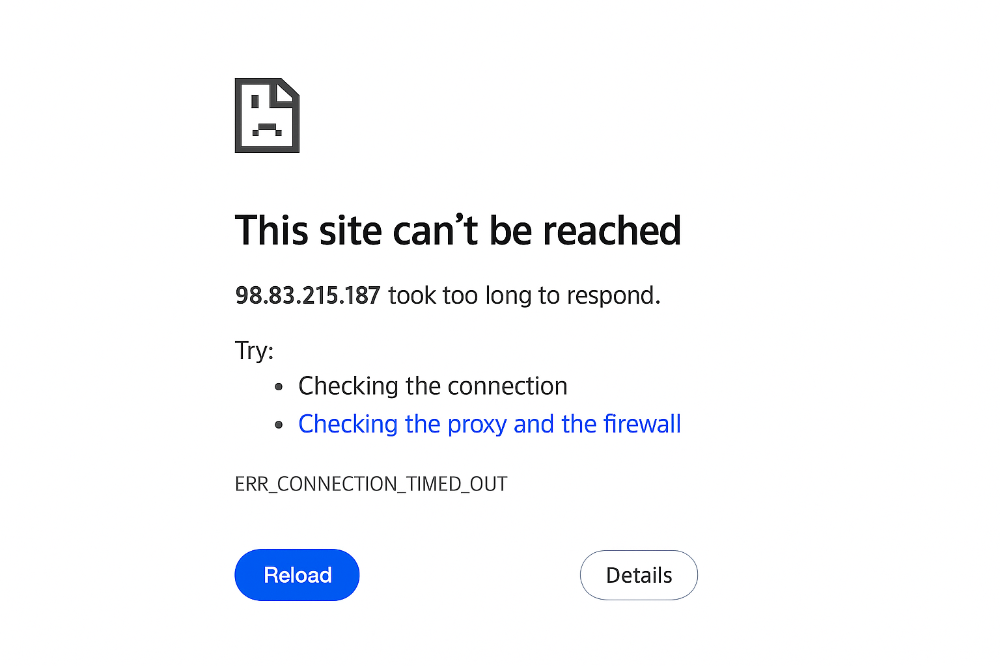
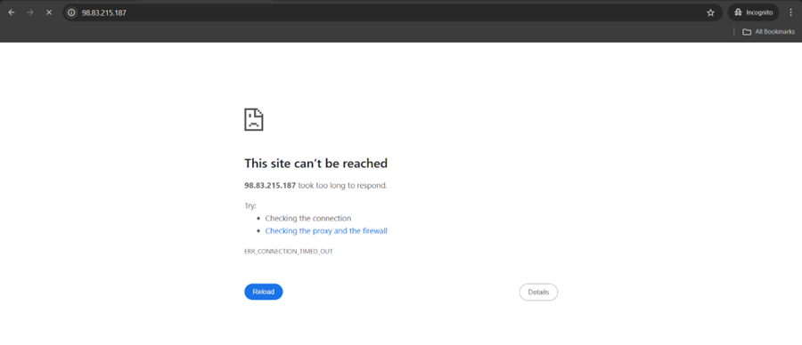
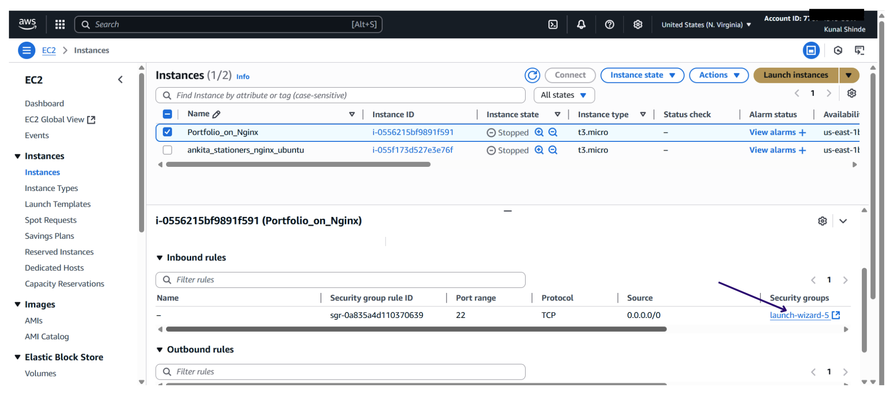
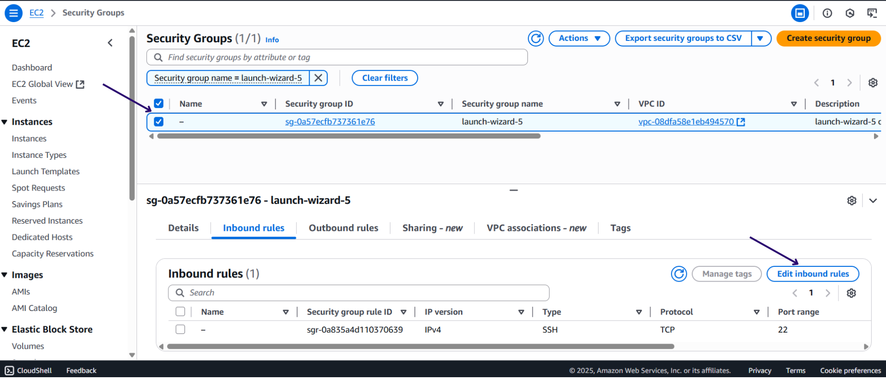
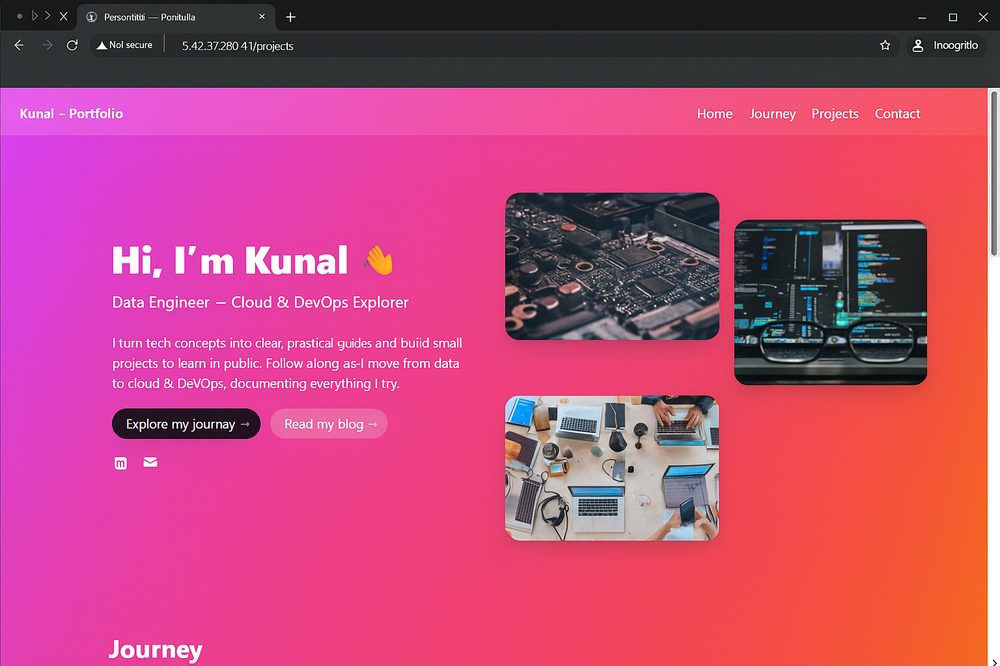

# Personal Portfolio Deployment on AWS with Nginx

*"From Local Machine to Live Server – My First Portfolio Deployment Journey"*

---

## Overview

This project demonstrates how I created a personal portfolio website on my **local machine**, copied it to an **Amazon Linux EC2 instance**, and successfully deployed it using the **Nginx web server**.

---

## Prerequisites

Before starting, make sure you have:

1. **AWS EC2 Instance**

   * Running Amazon Linux 2
   * Accessible via SSH with a valid key pair

2. **Security Group Setup**

   * Port **22 (SSH)** open for connecting
   * Port **80 (HTTP)** open for serving the website

3. **Key Pair (.pem file)**

   * Required for authentication while copying files using SCP

4. **Portfolio Files**

   * Your local `index.html`, CSS, JS, and assets ready

---

## Steps Followed

### 1. Copying Files to EC2

```bash
# Copy a single file
scp -i "<key-pair>.pem" <file> ec2-user@<ip-address>:/home/ec2-user/

# Copy a directory
scp -i "<key-pair>.pem" -r <dir_name> ec2-user@<ip-address>:/home/ec2-user/
```

---

### 2. Installing and Starting Nginx

```bash
sudo yum update -y
sudo yum install nginx -y

# Start and enable nginx
sudo systemctl start nginx
sudo systemctl enable nginx
```

---

### 3. Deploying Portfolio Files

```bash
# Copy index.html and assets to nginx default directory
sudo cp index.html /usr/share/nginx/html/
sudo ls /usr/share/nginx/html/
```

---

### 4. Testing Deployment

```bash
# Check nginx status
systemctl status nginx

# Test locally
curl localhost
```

#### Important: Testing without inbound rules

If you directly try to open your public IP in the browser **without configuring inbound rules for HTTP (port 80)**, you will see an error (refer screenshot).


Although Nginx is running on your server, the HTTP requests are being blocked because the security group has not allowed incoming traffic on port 80.

To fix this:

1. Go to **EC2 Instances tab** in AWS Console, select the checkbox for your respective instance.
2. Under the **Security tab**, look for the attached **launch-wizard** security group. (refer screenshot)

3. Select the **security group checkbox**, scroll down, and click **Edit inbound rules**. (refer screenshot)

4. Add a new rule:

   * **Type**: HTTP
   * **Source**: Anywhere-IPv4 (0.0.0.0/0)(refer screenshot)
     
5. Save the rules.

Now try to access your portfolio again with your public IP:

```
http://<your-ec2-public-ip>
```


It should load successfully.

---

## Result

My personal portfolio is now live on an Amazon Linux EC2 instance with Nginx serving as the web server.

---

## Tech Stack

* Amazon Linux 2 (EC2)
* Nginx (Web Server)
* SCP (for file transfer)
* HTML/CSS/JS (Portfolio content )

---

## Summary 

In this project, I built a personal portfolio on my local machine, securely copied it to an AWS EC2 instance using SCP, and deployed it with Nginx. Initially, access was blocked due to missing inbound rules for HTTP, but after adding port 80 access in the EC2 security group, the portfolio was successfully accessible via the public IP. This marks my first successful end-to-end website deployment journey on the cloud.

---

